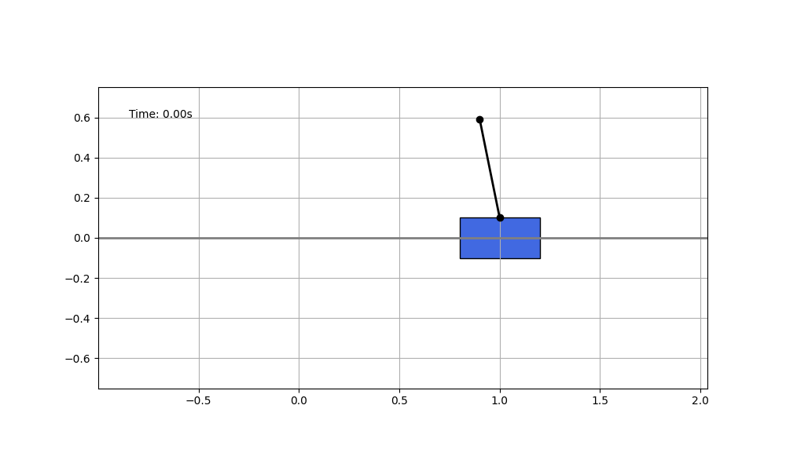
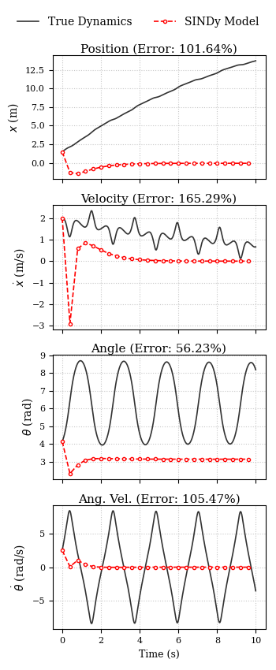
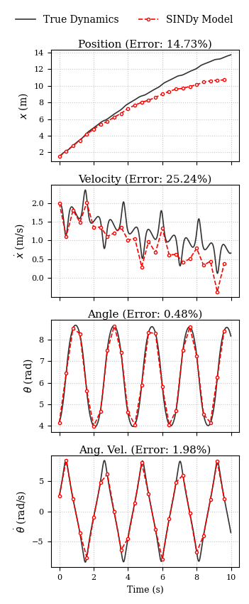
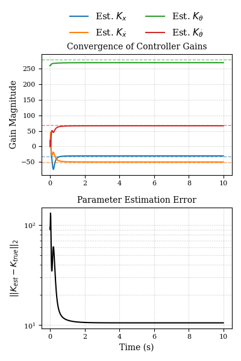

<div align="center">

# Data-Driven Discovery of Implicit Dynamics from Systems Under Feedback Control

### Solving the "Ghost Controller" Problem using Implicit SINDy & RLS


</div>

## Project Overview

Discovering physical laws from data is hard. It is even harder when the system is **unstable** and operating under **feedback control** (e.g., an aircraft in flight).

This project investigates the inverted pendulum on a cart, a canonical benchmark. We demonstrate a critical pitfall in data-driven modeling: when a system is tightly controlled (e.g., via LQR), discovery algorithms like **SINDy** fail to learn the physics. Instead, they learn a hybrid "Ghost Controller" model that fails spectacularly in the real world.

<p align="center">
  
</p>

**We solve this using a Two-Stage Framework:**
1.  **Structural Discovery:** Using **Implicit SINDy (SINDy-PI)** on rich, open-loop data to discover the inertial physics.
2.  **Joint Refinement:** Using **Recursive Least Squares (RLS)** on closed-loop data to mathematically decouple the plant friction from the hidden controller gains.

## The Core Challenge: The "Ghost Controller"

When collecting data from a system like a pendulum stabilized by a controller $u = -Kx$, there is a perfect functional dependence between the state $x$ and input $u$. 

### The Illusion of Success
A naive SINDy model trained on this data achieves nearly **0% error** on the test set (see below, left). It seems perfect.

### The Reality of Failure
However, if we turn the controller **OFF** and let the pendulum swing, the naive model still predicts that the pendulum will magically balance itself. This is the **Ghost Controller Effect**.

<div align="center">

| 🔴 The Problem (Naive LQR) | 🟢 The Solution (State-Decoupled) |
|:---:|:---:|
| *Model predicts damping despite no control* | *Model correctly predicts chaotic swinging* |
|  |  |

</div>

### Success decoupling of system & controller dynamics
By applying our **Two-Stage Framework** (SINDy for Structure $\to$ RLS for Parameters), we achieved what naive methods could not. The plot below shows the Recursive Least Squares (RLS) estimator running on closed-loop data.

**The Result:**
1.  It correctly identifies the **Friction Coefficient ($b$)** (separating it from the velocity gain).
2.  It converges to the **True LQR Gains ($K$)** within seconds.

<div align="center">

| Parameter Convergence (RLS) |
|:---:|
| *The estimated gains (solid lines) rapidly converge to the true values (dashed lines).* |
|  |
| **Identification Error:** < 4% |

</div>

This proves that **hybrid data-driven modeling** (combining open-loop structural discovery with closed-loop parameter estimation) is a viable path for identifying autonomous systems.

## Repository Structure

The codebase is organized for modularity and reproducibility.

```text
CartPendulum_SINDyC/
├── data/                   # Stores raw simulation data and generated figures
│   ├── 
├── scripts/                # Executable scripts for the research pipeline
│   ├── generate_data.py        # 1. Run Simulation & Control
│   ├── run_sindy_pipeline.py   # 2. Discover Structural Physics
│   ├── estimate_gains.py       # 3. Decoupling via RLS
│   └── test_model.py           # 4. Validate & Plot Results
├── src/                    # Core Logic & Libraries
│   ├── config.py               # Physical parameters & SINDy settings
│   ├── dynamics.py             # True coupled ODEs of the system
│   ├── controller.py           # LQR design & control laws
│   ├── discover_model.py            # Implicit SINDy algorithm
│   ├── filter.py               # RLS filter implementation
│   └── visualise.py        # Plotting & Animation utilities
└── requirements.txt
```

## Getting Started

### 1. **Installation**
Clone the repository and install the required packages.

```bash
git clone https://github.com/Charukhesh/CartPendulum_SINDyC.git
cd CartPendulum_SINDyC
pip install -r requirements.txt
```

### 2. **The Workflow**
This research is broken down into sequential scripts found in the `scripts/` folder.

#### **Step 1: Generate Data**
Simulate the inverted pendulum. You must decide on the control regime in the code (LQR vs. Sinusoidal Excitation).
```bash
python scripts/generate_data.py
```
**Note:** Inside `generate_data.py`, you can switch between `controller` (lqr control) and indep_controller (sinusoidal forcing for success) by commenting/uncommenting the respective function calls.

#### **Step 2: Discover Physics (Implicit SINDy)**
Run the Two-Pass STLSQ algorithm to find the coupled implicit equations.
```bash
python scripts/run_sindy_pipeline.py
```
Outputs symbolic expressions for `ddot{x}` and `ddot{theta}` and the estimated states from the SINDy model.

#### **Step 3: Validation**

Test the discovered SINDy model on unseen open-loop data or large-angle conditions.

```bash
python scripts/test_model.py
```
Outputs the estimated states for the test case scenario.

#### **Step 4: Decouple Controller (RLS)**

Use RLS on closed-loop data to estimate friction and controller gains:

```bash
python scripts/estimate_gains.py
```
Outputs the estimated decoupled controller and system dynamics.

## Methodology Details

### Implicit SINDy (Two-Pass STLSQ)

Standard SINDy assumes `dot{x} = f(x)`.  
Our system is **implicit**:

```
M(x) ddot{x} + f(x, dot{x}) = F
```

We construct a library `Θ(x, dot{x}, ddot{x}, u)` and identify a null-space vector `ξ` such that:

```
Θ ξ ≈ 0
```

Two-pass procedure:

- **Pass 1:** Identify dominant physical law.
- **Pass 2:** Find a second independent law orthogonal to the first.

### Recursive Least Squares (RLS)

Once SINDy identifies the inertial structure, the force balance becomes:

```
F_inertial = u_control - F_friction
```

RLS estimates unknown parameters:

- friction `b`
- controller gains `K`

using closed-loop measurements.

## References

1. S. L. Brunton, J. L. Proctor, and J. N. Kutz. ”Discovering governing equations from data by sparse identification of nonlinear dynamical
systems.” Proceedings of the National Academy of Sciences, 2016.
2. N. M. K. Kaheman, J. N. Kutz, and S. L. Brunton. ”SINDy-PI: a robust algorithm for parallel implicit sparse identification of nonlinear
dynamics.” Proceedings of the Royal Society A, 2020. (Implicit SINDy).
3. K. F. L. C. B. S. L. Brunton. ”Data-driven discovery of coordinates and
governing equations.” Applied Physics Reviews, 2019.(SINDy with Control).
